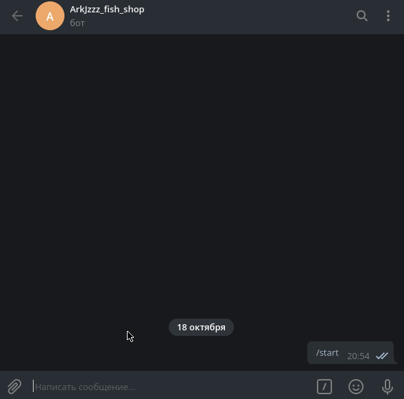
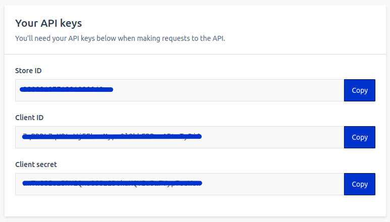
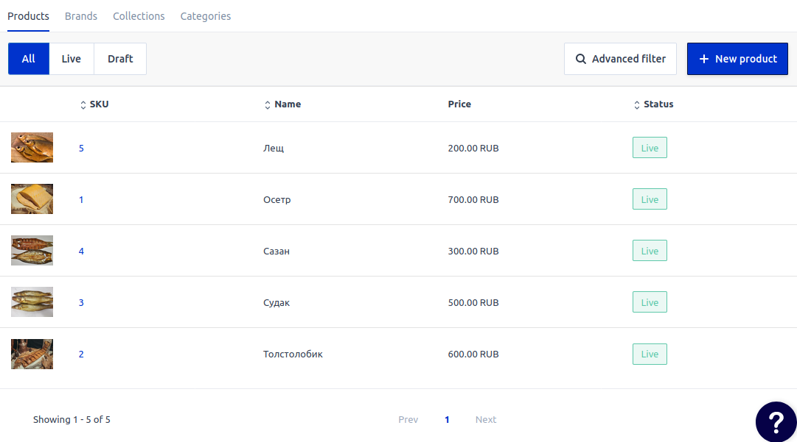

# fish_shop

Чат-бот-магазин для Telegram.

Реализованные функции: 

- Интеграция по API с CMS [Elastic Path](https://www.elasticpath.com/) (ранее Moltin)
- Отслеживание действий пользователя с помощью конечного автомата (Finite-State Machine)
- Inline кнопки
- Отправка изображений в чат




## Подготовка

- **Elastic Path**
    
    Зарегистрируйтесь на [Elastic Path](https://www.elasticpath.com/).

    Получите [ключи для доступа к API](https://dashboard.elasticpath.com/app).

    


    Создайте товары [в каталоге товаров](https://dashboard.elasticpath.com/app/catalogue/products)

    


- **Telegram**

    Напишите [Отцу ботов](https://telegram.me/BotFather):

    ```
    \start
    ```

    ```
    \newbot
    ```

    Получите токен для доступа к API Telegram.

- **Redis**

    Зарегистрируйтесь на [redislabs](https://redislabs.com/).

    Получите адрес БД вида `redis-13965.f18.us-east-4-9.wc1.cloud.redislabs.com`, его порт вида: `16635` и его пароль.


## Установка

- Клонируйте репозиторий:
```
git clone https://github.com/ArkJzzz/fish_shop.git
```

- Создайте файл ```.env``` и поместите в него токены Telegram и Elastic Path, а так же данные для доступа к Redis:
```
TELEGRAM_TOKEN=<Ваш токен>
ELASTICPATH_CLIENT_ID=<Client ID>
REDIS_HOST=<Адрес БД>
REDIS_PORT=<Порт>
REDIS_DB=<Номер БД, по умолчанию 0>
REDIS_PASSWORD=<Пароль>
```

- Установите зависимости:
```
pip3 install -r requirements.txt
```

## Запуск

```
python3 tg-bot.py
```


------
Пример работающего бота-магазина: [@ArkJzzz_fish_shop_bot](https://telegram.me/ArkJzzz_fish_shop_bot)